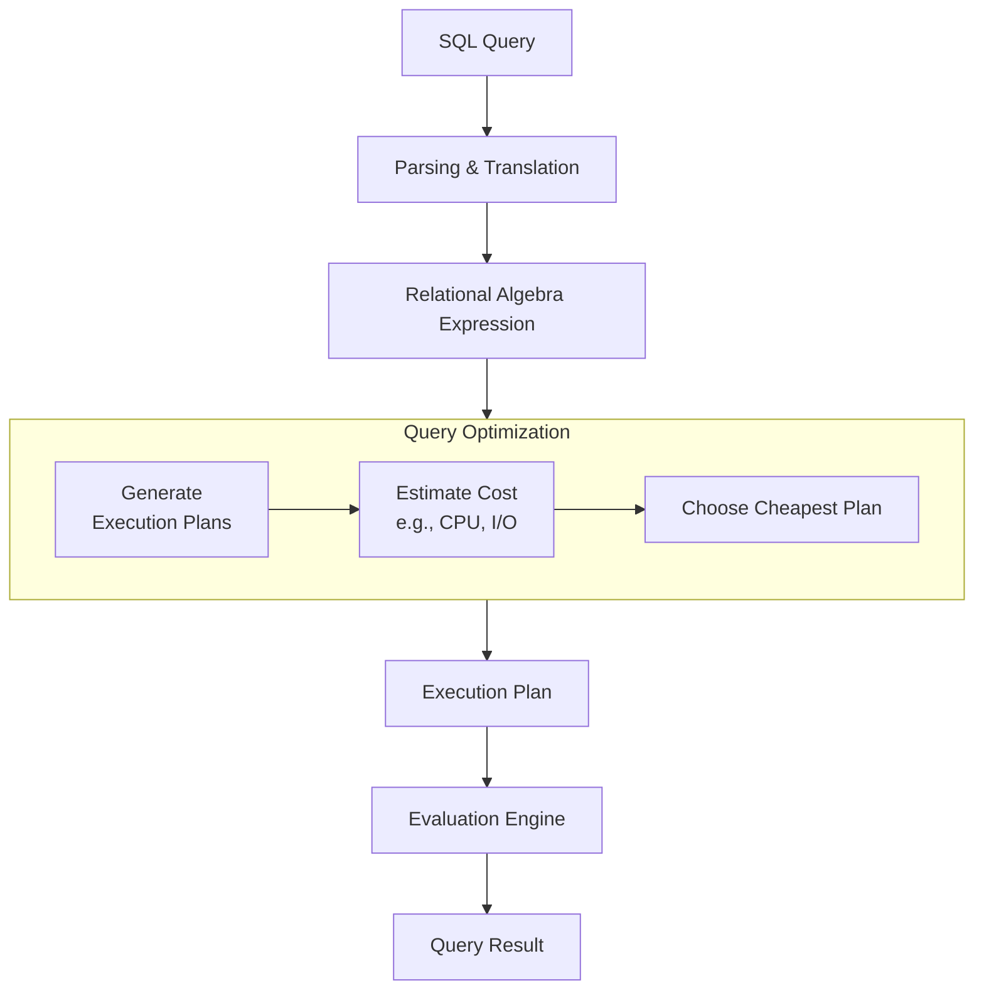

(4 Hours / 8 Marks)

# 5.0 Introduction
### A. Query Processing
- Query processing is the entire process of 
	- translating a high-level query like SQL 
	- into a correct and efficient execution plan 
	- that can be run on the physical database, and 
	- then executing that plan to retrieve the requested data.
### B. Steps in Query Processing
The process involves a series of transformations from a declarative SQL statement to low-level file operations. The key steps and their flow is visualised below:

1. Step 1: Parsing & Translation:
	- The parser checks the syntax and semantics of the SQL query.
	- It verifies that the table and column names exist.
	- The query is then translated into an internal representation, most commonly a Relational Algebra Expression
	- Example:
		- SQL: `SELECT name FROM employee WHERE salary > 50000;`
		- RAE: $\Pi_{name}\ (\sigma_{salaray > 50000}\ (employee))$
2. Step 2: Query Optimisation
	- Critical step.
	- The optimiser generates various logically equivalent plans for every given query and selects the one with the lowest estimated cost.
	- Cost is measured in terms of expected disk I/O (number of blocks read/written), CPU usage and memory consumption.
	- Example:
		- For every query like `SELECT * FROM table1 JOIN table 2 ON ...`, the optimiser decides:
			- Should it use Nested-loop or Hash-join?
			- Which table should be the outer and which should be the inner?
			- Should it use an available index?
3. Step 3: Evaluation Engine:
	- The evaluation engine takes the selected execution plan and executes it.
	- It interacts with the underlying storage manager to fetch the data from the database files, apply the necessary operations (like filtering, sorting, joining) and return the final result to the user.
### C. Query Optimisation Explained:
- **Goal**: To find the most efficient execution strategy among many equivalent options
- **Necessary because**: The performance difference between a good and a bad plan for the same query can be orders of magnitude (seconds vs. hours).
- **Working**:
	1. Generate Plans:
		- The optimiser uses RAE (Relational Algebra Equivalence) rules to create different plans
		- Example rule: $\sigma_{\theta_1}\ (\sigma_{\theta_2}\ (R)) = \sigma_{\theta_2}\ (\sigma_{\theta_1}\ (R))$
		- Applying filters early is often better.
	2. Estimate Cost
		- For each plan, it estimates the cost using database statistics (e.g., number of tuples in a relation, size of a tuple, number of distinct values in a column).
	3. Choose Plan:
		- The plan with the lowest estimated cost is selected for execution.
### D. Task of the Evaluation Engine
- The evaluation engine is the worker that carries out the instructions of the chosen execution plan. Its specific tasks include:
1. Interpreting the Plan: It reads the low-level operations defined in the execution plan.
2. Interfacing with Storage: It calls the file and access methods of the DBMS to read data blocks from disk into memory buffers.
3. Executing Operations: It performs the core relational operations:
	- Selection ($\sigma$): Iterates over rows and applies the `WHERE` clause conditions
	- Projection ($\Pi$): Removes unwanted columns, often including duplicate elimination.
	- Join ($\bowtie$): Implements the specific join algorithm (e.g., Nested Loop, Sort-Merge, Hash Join) as dictated by the Optimiser
	- Sorting & Aggregation: Executes `ORDER BY` and `GROUP BY` clauses.
4. Returning Results:
	- It manages the final result set and passes it back to the client application.
# 5.1 Pipelining

1. What is pipelining, explain with example.
2. briefly explain the pipelining approaches
3. how is pipeline approach different from materialisation approach?
# 5.2 Query Cost Estimation

# 5.3 Query Operations
# 5.4 Evaluation of Expressions

1. how is a query evaluated in entire expression tree
2. method used for evaluation of entire expression tree
3. explain various approaches used to evaluate any expression with example.
4. explain  the difference between materialisation and pipelining methods for query evaluation
5. major disadvantage of using materialisation approach
6. how does pipelining overcome those disadvantage
7. Transform the following relational algebra expression using equivalence rule. Show each step involved.
instructor (ID, name, dept name, salary)
teaches (ID, course id, sec id, semester, year)
course (course id, title, dept name, credits)
Πname, title (σdept name = “Music”ˆyear = 2017
(instructor) ▷◁ (teaches ▷◁ Πcourse id, title (course))))
# 5.5 Query Optimisation
1. Write short notes on Query Optimisation
2. Different approaches for Query Optimisation
3. How are equivalence rules for relational algebra helpful for query optimisation? explain with examples
4. Explain cost based optimisation and heuristic optimisation. write their differences.
5. Explain how a DBMS chooses an appropriate query execution plan for optimised query execution.
6. explain process of query optimisation
7. How can you optimise:
   Πname, title (σdept name=“Music” (instructor ▷◁ Πcourse id, title (teaches ▷◁ course)))
8. 
# 5.6 Query Decomposition
# 5.7 Performance Tuning