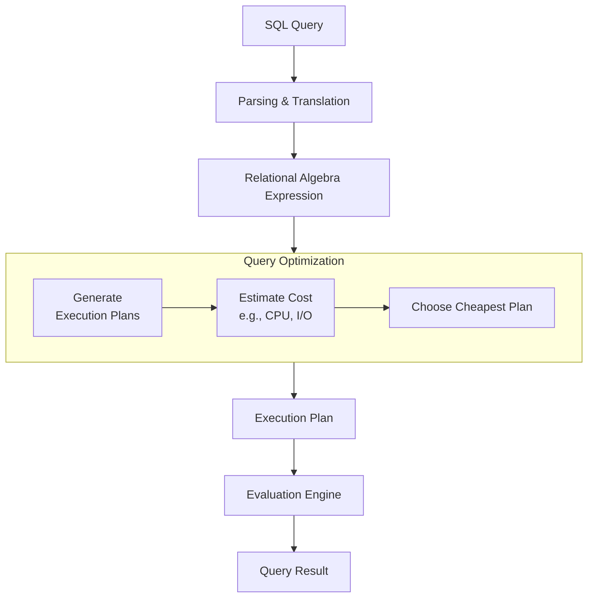
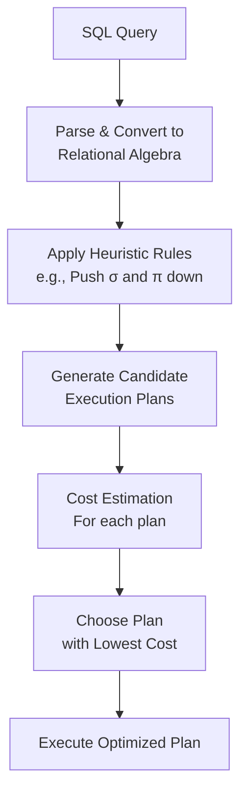

(4 Hours / 8 Marks)

# 5.1 Introduction
### A. Query Processing
- Query processing is the entire process of 
	- translating a high-level query like SQL 
	- into a correct and efficient execution plan 
	- that can be run on the physical database, and 
	- then executing that plan to retrieve the requested data.
### B. Steps in Query Processing
The process involves a series of transformations from a declarative SQL statement to low-level file operations. The key steps and their flow is visualised below:

1. Step 1: Parsing & Translation:
	- The parser checks the syntax and semantics of the SQL query.
	- It verifies that the table and column names exist.
	- The query is then translated into an internal representation, most commonly a Relational Algebra Expression
	- Example:
		- SQL: `SELECT name FROM employee WHERE salary > 50000;`
		- RAE: $\Pi_{name}\ (\sigma_{salaray > 50000}\ (employee))$
2. Step 2: Query Optimisation
	- Critical step.
	- The optimiser generates various logically equivalent plans for every given query and selects the one with the lowest estimated cost.
	- Cost is measured in terms of expected disk I/O (number of blocks read/written), CPU usage and memory consumption.
	- Example:
		- For every query like `SELECT * FROM table1 JOIN table 2 ON ...`, the optimiser decides:
			- Should it use Nested-loop or Hash-join?
			- Which table should be the outer and which should be the inner?
			- Should it use an available index?
3. Step 3: Evaluation Engine:
	- The evaluation engine takes the selected execution plan and executes it.
	- It interacts with the underlying storage manager to fetch the data from the database files, apply the necessary operations (like filtering, sorting, joining) and return the final result to the user.
### C. Query Optimisation Explained:
- **Goal**: To find the most efficient execution strategy among many equivalent options
- **Necessary because**: The performance difference between a good and a bad plan for the same query can be orders of magnitude (seconds vs. hours).
- **Working**:
	1. Generate Plans:
		- The optimiser uses RAE (Relational Algebra Equivalence) rules to create different plans
		- Example rule: $\sigma_{\theta_1}\ (\sigma_{\theta_2}\ (R)) = \sigma_{\theta_2}\ (\sigma_{\theta_1}\ (R))$
		- Applying filters early is often better.
	2. Estimate Cost
		- For each plan, it estimates the cost using database statistics (e.g., number of tuples in a relation, size of a tuple, number of distinct values in a column).
	3. Choose Plan:
		- The plan with the lowest estimated cost is selected for execution.
### D. Task of the Evaluation Engine
- The evaluation engine is the worker that carries out the instructions of the chosen execution plan. Its specific tasks include:
1. Interpreting the Plan: It reads the low-level operations defined in the execution plan.
2. Interfacing with Storage: It calls the file and access methods of the DBMS to read data blocks from disk into memory buffers.
3. Executing Operations: It performs the core relational operations:
	- Selection ($\sigma$): Iterates over rows and applies the `WHERE` clause conditions
	- Projection ($\Pi$): Removes unwanted columns, often including duplicate elimination.
	- Join ($\bowtie$): Implements the specific join algorithm (e.g., Nested Loop, Sort-Merge, Hash Join) as dictated by the Optimiser
	- Sorting & Aggregation: Executes `ORDER BY` and `GROUP BY` clauses.
4. Returning Results:
	- It manages the final result set and passes it back to the client application.
### E. Materialised Views
- database object that contains the result of a query.
- Unlike a standard (virtual) view, which is just a saved query that runs each time it is referenced, a materialised view pre-computes and physically stores the result data on disk, just like a regular table.
	- **Standard View**: A saved SQL query. When you query the view, the underlying query runs in real time.
	- **Materialised View**: A saved SQL query, plus its pre-computed result set stored as a physical table.
- Significance:
	- The primary significance lies in dramatically improving query performance for complex reports and dashboards, especially in data warehouses and decision support systems.
	1. Drastic Performance Improvement
	2. Reduction in Computational Load
	3. Support for Data Warehousing and Business Intelligence
	4. Network Efficiency in Distributed Databases
----
# 5.2 Evaluation of Expressions
## A. Materialisation Approach
- Concept:
	- Materialisation is an evaluation strategy where each operation in the query execution tree is executed to completion, with its entire result set stored in a temporary relation on disk, before passing it to the next operation.
- Working:
	1. Start from the lowest level operations in the expression tree (scanning base tables).
	2. Execute the operation and write all resulting tuples to a temporary disk file.
	3. Use this temporary file as the input for the next higher-level operation
	4. Repeat until the root operation produces the final result.
- Example:
	- Query: "Find the names of all instructors in the 'Music' department.".
	- Relational Algebra: $\Pi_{name}\ (\sigma_{\text{dept\_name=`Music'}}\ (\text{Instructor}))$
	- Evaluation Steps (i.e. Materialisation):
		- Execute the selection ($\sigma$): Scan the `Instructor` table and find all the tuples where `dept_name` = '`Music`'.
		- Write all these matching tuples to a temporary table `Temp1`.
		- Execute the projection ($\Pi$): Read `Temp1` and extract only the `name` column, writing the final result to the output.
- Major disadvantage:
	- High I/O cost: creating and reading temporary tables for intermediate results involves significant disk r/w operations, which are slow.
	- High memory overhead: Storing large intermediate results can consume substantial disk space.
	- Slow response time: The entire process for one operation must finish before the next can begin. This delays the production of the first output tuple.
## B. Pipelining Approach
- Concept:
	- Pipelining is an evaluation strategy where the output of one operation is passed directly to the next operation as input, without storing the entire intermediate result on disk.
	- Tuples are processed in a streaming fashion.
- Working:
	- Operations are linked together in a pipeline.
	- As soon as one operation produces a tuple (or a buffer of tuples), it is immediately passed to the next operation for processing.
	- This creates a 'flow' of data through the query plan.
- Example:
	- Same query as before: "Find the names of all instructors in the 'Music' department.".
	- Relational Algebra: $\Pi_{name}\ (\sigma_{\text{dept\_name=`Music'}}\ (\text{Instructor}))$
	- As soon as it finds a tuple where `dept_name` = '`Music`', it passes that single tuple immediately to the projection operation ($\Pi$).
	- The projection operation takes the tuple, extracts the `name`, and sends it to the output.
	- The user sees the first result almost instantly, without waiting for all '`Music`' instructions are to be found.
- How it improves Efficiency:
	- Eliminates Temporary Storage: No need to write/read intermediate results to disk, drastically reducing I/O cost.
	- Faster Initial Response: The first result can be output as soon as it is generated, improving user experience.
	- Better Memory Utilisation: Tuples are processed in buffers and kept in memory, which is much faster than disk access.
## C. Comparison:
| Feature                 | Materialisation                                                 | Pipelining                                           |
| ----------------------- | --------------------------------------------------------------- | ---------------------------------------------------- |
| Intermediate Results | Stored as temporary tables on disk                              | Passed directly in memory between operations.        |
| I/O Cost                | High                                                            | Low                                                  |
| Memory Usage         | High (for temp files)                                           | Moderate (for in-memory buffers)                     |
| Time to First Result | Slow (must compute full result first)                           | Fast (results streamed immediately)                  |
| Suitability             | Useful if the entire result set is needed by the next operation | Ideal for interactive queries and online processing. |
#### How pipelining overcomes materialisation's disadvantages:
- Pipelining directly addresses the core drawbacks of materialisation by avoiding creation of temporary tables, thereby slashing I/O costs and memory overhead and delivering results with lower latency.
----
# 5.3 Query Optimisation
## A. Concept
- Query optimisation is the process of selecting the most efficient execution strategy for a given query from among many logically equivalent alternatives.
- The goal is to minimise resource usage (CPU, I/O, memory) and response time.
- Crucial: The performance difference between a good and bad execution plan for the same query can be orders of magnitude (seconds vs. hours) so queries need to be optimised.
## B. Two Fundamental Approaches
### B.1 Heuristic Optimisation (Rule-Based)
- Uses a set of pre-defined rules (heuristics) to transform a query into a more efficient form.
- It does not consider the actual data size or distribution.
- It follows a simple strategy "Follow these rules, generally get a better plan".
- Key Technique: Rearranging the relational algebra operations using equivalence rules.
- Advantage: Low overhead, fast optimisation time.
- Disadvantage. May not always choose the absolute best plan because it ignores data characteristics.
### B.2 Cost Based Optimisation
- Generates multiple alternative execution plans, estimates the cost (in terms of I/O, CPU, etc.) for each, and selects the plan with the lowest estimated cost.
- It follows a strategy of "Measure and compare different strategies to find the cheapest one.".
- Key Technique: Uses database statistics (number of tuples, index availability, attribute distribution) to calculate cost.
- Advantage: Can find better plans tailored to specific data
- Disadvantage: Higher optimisation overhead due to cost calculations.
### B.3 Comparison
| Feature          | Heuristic Optimisation          | Cost-Based Optimisation                |
| ---------------- | ------------------------------- | -------------------------------------- |
| Basis            | Pre-defined rules and logic     | Statistical data about the database    |
| Plans            | Has a single path to follow     | Develops alternatives to choose from   |
| Cost Calculation | No cost calculation             | Detailed cost estimation for each plan |
| Overhead         | Low                             | High                                   |
| Optimality       | Good, but not guaranteed        | Finds the best among generated plans   |
| Adaptability     | Static; same rules for all data | Dynamic; adapts to data distribution   |
- In modern DBMS, hybrid approach is used.
- Heuristics to generate a set of plausible plans.
- Use cost-based optimisation to choose the best from that set.
## C. Query Optimisation Process
- The process of how a DBMS chooses an optimal query execution plan can be broken down into following steps, which blend both heuristic and cost-based methods:

#### Steps:
1. Parsing and Translation
	- The SQL query is parsed for syntax and converted into an initial relational algebra expression tree.
2. Heuristic Rewriting (Logical Optimisation)
	- The optimiser applies equivalence rules to rearrange the initial tree into a more efficient logical form.
	- This is where heuristic optimisation primarily occurs
3. Plan Generation (Physical Optimisation)
	- For the logically optimised tree, the optimiser generates multiple physical execution plans.
	- This involves choosing:
		- Access Methods: Should it use a sequential scan or an index scan?
		- Join Algorithms: Should it use Nested-loop, Join, Hash Join or Sort-Merge Join?
		- Join Ordering: In what order should the tables be joined?
4. Cost Estimation & Selection
	- This is the cost-based phase.
	- The optimiser estimates the cost of each generated physical plan using database statistics and selects the cheapest one for execution.
## D. Equivalence Rules in Relational Algebra
- Equivalence rules are the mathematical foundation of heuristic optimisation.
- They state that two relational algebra expressions are equivalent (i.e., they yield the same result) but have vastly different execution costs.
- Rules:
1. Pushing Selections ($\sigma$):
	- Rule: $\sigma_{p1\ \wedge\ p2}\ E\ \equiv\ \sigma_{p1}\ (\sigma_{p2}\ (E))$.
	- Rule: $\sigma_{p}\ (E1\ \bowtie\ E2)\ \equiv\ \sigma_p\ (E1)\ \bowtie\ E2$, if predicate `p` only references attributes from `E1`.
	- Example: $\sigma_{\text{salary > 50000}\ \wedge\ \text{dept=`Sales'}}\ (Employee)$ can be broken into $\sigma_{\text{dept = `Sales'}}\ (\sigma_{\text{salary > 50000}})$
2. Pushing Projections ($\Pi$):
	- Rule: $\Pi_{a1, a2, ..}\ (E1 \bowtie\ E2)\ \equiv\ \Pi_{a1, a2, ...} (\Pi_{b1, b2, ..}\ (E1)\ \bowtie\ \Pi_{c1, c2, ..}\ (E2) )$,
		- Where, $b_i$ and $c_i$ are the attributes from E1 and E2 needed for the join and the final result.
	- Example: If you need only name and title from a join of instructor and teacher, project only those columns early to reduce the data volume being joined.
3. Commutativity and Associativity of Joins ($\bowtie$):
	- $E1\ \bowtie\ E2\ \equiv\ E2\ \bowtie\ E1$
	- $(E1\ \bowtie\ E2)\ \bowtie\ E3 \equiv\ E1\ \bowtie\ (E2\ \bowtie\ E3)$
	- Significance: These rules allow the optimiser to choose the most efficient join order.
	- Joining the smallest tables first to create a smaller intermediate result is usually cheaper.
## E. Transforming Relational Algebraic Expressions
- Query optimiser uses equivalence rules to transform an initial query tree into a more efficient, logically equivalent one.
- The goal is to make the query cheaper to execute.
#### Problem (`80 Bh`)
- Transform the given expression for efficiency
##### Given:
`instructor (ID, name, dept_name, salary)
`teaches (ID, course_id, sec_id, semester, year)`
`course (course_id, title, dept_name, credits)`
##### Original Expression:
$$
\Pi_{\text{name, title}}\ (\sigma_{\text{dept\_name = `Music'}\ \wedge\ \text{year = 2017}}\ ((\text{instructor}) \bowtie\ (\text{teaches} \bowtie\ \Pi_{\text{course\_id, title}}\ (\text{course}))))
$$
##### Step by Step Transformation using Equivalence Rules:
1. Push Selection ($\sigma$) Down: Selections are among the most expensive operations. We push them down to reduce the size of intermediate relations before performing joins.
	- Rule Used: $\sigma_{p}\ (E1 \bowtie\ E2) \equiv (\sigma_p\ (E1)) \bowtie\ E2$, if predicate `p` only uses attributes from `E1`.
	- We break the compound selection and push `dept_name = 'Music'` to the `instructor` relation and `year=2017` to the `teaches` relation.
2. Transformed Expression: 
   $\Pi_{\text{name, title}}\ ($
	   $(\sigma_{\text{dept\_name=`Music'}}\ (\text{instructor}))$
	   $\bowtie$
	   $(\sigma_{\text{year=2017}}\ (teaches)\ \bowtie\ \Pi_{\text{course\_id, title}}\ (course))$
	 $)$
3. Push Projection ($\Pi$) Down: To reduce the number of columns carried through the joins, we project only the necessary attributes early.
	- Rule Used: $\Pi_{\text{a1, a2, ...}}\ (E1 \bowtie\ E2) \equiv (\ \Pi_{\text{a1, a2, ...}}\ (E1)) \bowtie\ (\ \Pi_{\text{a1, a2, ...}}\ (E2)))$, where the attributes are chosen to ensure the join can still be performed and the final result is correct.
	- We project `instructor` to just `ID, name`.
	- We project `teaches` to just `ID, course_id`.
	- The `course` relation is already projected to `course_id, title`.
4. Final Optimised Expression:
   $\Pi_{\text{name, title}}\ ($
	   $( \Pi_{\text{ID, name}}\ (\sigma_{\text{dept\_name=`Music'}}\ (\text{instructor})))$
	   $\bowtie$
	   $( \Pi_{\text{ID, course\_id}}\ ( \sigma_{\text{year=2017}}\ (\text{teaches}) ) \bowtie$
	   $\Pi_{\text{course\_id, title}}\ (\text{course})$
   $)$
5. Why this is optimised:
	- The joins now happen between much smaller relations
	- The `instructor` and `teaches` tables are filtered by their respective selections first, so fewer tuples need to be joined.
	- Each operation works with fewer columns, which means more tuples can fit in a single memory buffer.
#### Problem (71 Bh)
- Transform the given expression for efficiency
##### Original Expression:
$$
\Pi_{\text{name, title}}\ (\sigma_{\text{dept\_name=`Music'}}\ (\text{instructor}\ \bowtie\ \Pi_{\text{course\_id, title}}\ (\text{teaches}\ \bowtie \text{course})))
$$
##### Step by Step Transformation using Equivalence Rules:
1. Apply Heuristic: Push Selection ($\sigma$) Down.
	- The selection `dept_name='Music` only applies to instructor, so push it down.
	- Transformed Expression:
	  $$\Pi_{\text{name, title}}\ (\sigma_{\text{dept\_name=`Music'}}\ (\text{instructor})\ \bowtie\ \Pi_{\text{course\_id, title}}\ (\text{teaches}\ \bowtie \text{course}))$$
2. Apply Heuristic: Push Projection ($\Pi$) Down:
	- The final output only needs the `name` and `title`. 
	- For the join to work, we also need the joining keys (`ID` from instructor/teaches, `course_id` from teaches/course).
	- Project `instructor` down to `ID, name`.
	- Project `teaches` down to `ID, course_id`.
	- Final Optimised Expression:
	  $$\Pi_{\text{name, title}}\ (\Pi_{\text{ID, name}}\ (\sigma_{\text{dept\_name=`Music'}}\ (\text{insturctor}))\ \bowtie\ \Pi_{\text{ID, course\_id}}\ (\text{teaches})\ \bowtie \Pi_{\text{course\_id, title}}\ (\text{course})))$$
3. Why this is optimised:
	- The `instructor` table is filtered first, so the join works with far fewer rows.
	- Early projection ensures that each operation only deals with the necessary columns, reducing memory and I/O overhead.
	- The entire process is guided by heuristics, which a cost-based optimiser would then use to select the best join algorithms and access paths.

[[Chapter 6 File Structure and Hashing]]