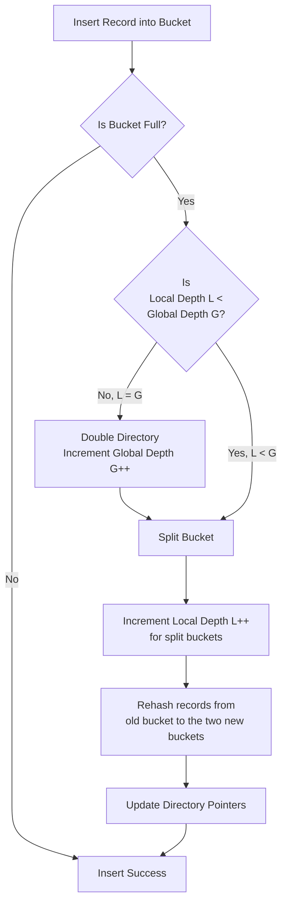

(4 Hours / 8 Marks)
# 6.1 Records Organisations
- Record Organisation refers to how individual data records (rows) are structured, stored and managed within database files.
- It deals with the physical representation of data on storage media.
## A. Types of Records based on Size:
### A.1 Fixed-Length Records
- Every record in a file has the same exact predefined size.
- Structure:
	- Each field has a fixed size (e.g., `CHAR(50)`, `INT`)
	- Padding is added if the actual data is shorter than the allocated space.
	- May include a small record header for metadata (e.g., null flags, record type).
- Storage & Access:
	- The location of the i$^{th}$ record can be calculated directly:
	  Location = Start of file + (i * Record's size).
	- This allows for direct access to any record.
- Advantages:
	- Fast Access: Direct record lookup via simple arithmetic.
	- Simple Management: Easy to implement and manage.
- Disadvantages:
	- Wasted Space: Significant internal fragmentation if data doesn't use the full allocated space.
	- Inflexibility: Cannot accommodate data that naturally varies in size.
- Example:
	- An `Employee` record defined as `(ID INT, Name CHAR(30), Salary DECIMAL(10,2))` will always be the same size (e.g., 48 bytes), regardless of whether an employee's name is "Bob" or "Charlie Mc'lovin"
### A.2 Variable-Length Records
- Records can have different sizes based on the actual data stored.
- This is common with `VARCHAR`, `BLOB` fields, or multi-record type files.
- Advantages:
	- Efficient Space Usage: No wasted space for unused character allocations
	- Flexibility: Can handle records of vastly different sizes.
- Disadvantages:
	- Slower Access: Cannot calculate record position directly; must follow pointers or scan a directory
	- Fragmentation: Deletions and updates can lead to fragmented free space, requiring periodic reorganisation.
- Storage Methods: Storing variable-length records requires more complex techniques to track where each record begins and ends.
	1. Length-Prefix Method:
		- Each variable-length field is preceded by its length.
		- The record itself may have a header storing the total record length.
		- e.g., Storing "Hello" would be stored as `[5][H][e][l][l][o]`.
	2. Pointer-Based:
		- The record is structured  as a fixed-length portion (for fixed fields and pointers) and a variable-length portion (for the actual data).
		- Implementation:
			- The fixed part contains the stable data and pointers (offsets) to the start of each variable-length field.
			- The variable part holds the actual strings or data blocks.
		- Example:
			- A record for `(ID INT, Name VARCHAR, Dept VARCHAR)` could be stored as:
			  `Fixed Part: [ 101 ] -> [ Ptr1 ] -> [ Ptr2 ]`
			  `Variable Part: [ A ][ l ][ i ][ c ][ e ][ S ][ a ][ l ][ e ][ s ]`
			  `                   ^                   ^`
			  `                 Ptr1                Ptr2`
	3. Slotted-Page Structure:
		- Most common in modern DBMS
		- A disk block (page) has three main sections:
			- Header: Contains the number of records and the location of free space.
			- Slot Array/Directory: An array of entries, where each entry stores (offset, length) of a record within the page.
			- Free space: The area where records are stored, typically growing from the end of the page towards the beginning
		- How it Works:
			- To find record `i`, the system checks slot `i` in the directory to get its location and size within the page.
			- This allows records to be easily moved within the page to maintain free space (compaction) without changing external references.
## B. Types of File Organisation
- They define how complete records are arranged and accessed in a file.
### B.1 Heap (Pile) File Organisation
- Records are stored in no particular order (FCFS).
- Operations:
	- Insertion: Very fast, added at the end of the file
	- Searching: Slow, Requires a linear scan (O(n))
	- Deletion: Mark record as deleted; requires periodic reorganisation to reclaim space.
- Best for: Bulk loading data, or when queries require a full table scan.
### B.2 Sequential File Organisation
- Records are stored in a sorted order based on an ordering key field.
- Operations:
	- Searching: Efficient for range queries and retrieving sorted data. Can use binary search.
	- Insertion/Deletion: Costly. Often requires rewriting the entire file or using overflow blocks to maintain order, which can degrade performance over time.
- Best For: Applications that frequently require data in a sorted order or process large ranges of records (e.g., reporting).
### B.3 Hash File Organisation
- A hash function is applied to a key field to compute the physical address (bucket number) where the record should be stored.
- Operations:
	- Exact-match search: Extremely fast (O(1) on average). Directly computes the address
	- Range-search: Inefficient. Requires scanning all buckets.
- Best For: Applications primarily needing fast point queries (e.g., retrieving a product by its ID).
### B.4 Clustered File Organisation
- Records from two or more different tables are stored intermingled together in same file.
- Typically done for tables that are frequently joined.
- Types:
	- Single-Table Clustering: Records of one table are stored together, often sorted. (essentially Sequential Organisation)
	- Multi-Table Clustering: Records from related tables are stored together. e.g., Storing an `Employee` record followed by all their `Dependent` records in the same disk block
- Advantage: Dramatically improves the performance of join operations, as related data is retrieved with a single disk I/O.
- Disadvantage: Can slow down queries that access only one of the clustered tables
### B.5 Indexing
- Records are stored in indexes like B-trees, B+ trees and bitmap indices.
- Secondary Structure that can be applied to any of the above file organisations.
### B.6 Improving Pointer Method with Anchor and Overflow Blocks
- Technique used in sequential and indexed files to manage insertions efficiently.
- In a sequentially ordered file, inserting a new record in the correct order requires shifting all subsequent records, which is very expensive.
- Solution:
	- Anchor Block: The mail file is divided into blocks. Records within each block are sorted. These are the anchor blocks.
	- Overflow Block: A separate block (or chain of blocks) is associated with each anchor block.
- Working:
	- When a new record needs to be inserted into a full anchor block, it is placed in the corresponding overflow block instead of shifting all records.
	- The overflow block is itself sorted or maintains a pointer to the next overflow block.
	- To read the data in order, the system reads the anchor block and then merges in the records from the overflow chain.
- Benefit: It defers the expensive reorganisation operation. The file can continue to function with good performance for a while before a full reorganisation is needed.
----
# 6.2 RAID
- RAID (Redundant Array of Independent Disks) is a data storage technology that combines multiple physical disk drives into a single logical unit to improve performance, increase storage capacity, and provide redundancy.
- RAID is commonly used in DBMS to enhance data reliability and performance.
- Characteristics:
	- Redundancy: Provides fault tolerance by duplicating data across multiple disks.
	- Performance: Can improve read and write speeds by distributing data across several disks.
	- Scalability: Offers various configurations to balance between performance, redundancy, and capacity.
	- Reliability: Increases data reliability and availability through different levels of redundancy and capacity.
- Advantages:
	- Increased Performance: Striping data across multiple disks can significantly improve read and write speeds.
	- Data Redundancy: Mirroring and parity provide fault tolerance, reducing the risk of data loss.
	- Scalability: Allows easy addition of more disks to increase storage capacity.
	- Improved Reliability: Redundant storage setups increase the overall reliability of the storage system.
- Disadvantages:
	- Complexity: RAID setups can be complex to configure and manage.
	- Cost: Requires multiple disks, which can increase hardware costs.
	- Rebuild Time: In case of disk failure, rebuilding the array (especially in RAID 5 or RAID 6) can be time-consuming and may impact performance.
### A. RAID 0 (Stripping):
- Data is split into blocks and distributed evenly across multiple disks without redundancy.
- Offers high read and write performance as multiple disks are accessed simultaneously.
- No fault tolerance, failure of a single disk results in data loss.
- Suitable for non-critical applications where performance is a priority.
### B. RAID 1 (Mirroring):
- Data is duplicated exactly on two or more disks.
- Read performance is improved (data can be read from any mirror), write performance is the same as a single disk.
- High fault tolerance; can tolerate the failure of one or more disks without data loss
- Ideal for critical applications requiring high availability and reliability.
### C. RAID 5 (Stripping with Parity)
- Data and parity information are stripped across three or more disks.
- Parity is distributed across all disks.
- Good read performance, write performance is reduced due to parity calculations.
- Can tolerate the failure of a single disk without data loss
- Suitable for applications requiring a balance between performance, capacity and redundancy
### D. RAID 6 (Stripping with Double Parity)
- Similar to RAID 5, but with double parity, allowing for the failure of up to two disks.
- Read performance is similar to RAID 5, write performance is slower due to additional parity calculations.
- High fault tolerance, can tolerate the failure of two disks without data loss.
- Suitable for high-availability systems requiring strong fault tolerance.
### E. RAID 10 (1+0, Mirroring and Stripping)
- Combined RAID 1 and RAID 0.
- Data is mirrored then stripped across multiple disks.
- Offers high read and write speed performance due to striping, combined with high fault tolerance due to mirroring.
- Can tolerate the failure of multiple disks (one in each mirrored pair) without data loss.
- Ideal for applications requiring both high performance and high availability.
### F. RAID 50 (5 + 0)
- Combines RAID 5 and RAID 0.
- Data is stripped across RAID 5 disks.
### G. RAID 60 (6 + 0)
- Combines RAID 6 and RAID 0.
- Data is stripped across RAID 6 arrays
----
# 6.3 Remote Backup System
- A remote backup system is a method of storing data copies offsite, ensuring that data can be recovered in case of local failures, disasters or other unforeseen events.
- This system involves transmitting data to a remote server or cloud-based storage solution over a network, providing an extra layer of security and redundancy.
- Characteristics:
	- Offsite Storage: Data is stored at a geographically different location from the primary data source, protecting it from local disasters.
	- Automated Processes: Backups are often automated, reducing the risk of human error and ensuring regular updates.
	- Accessibility: Easy to scale storage capacity according to needs, especially with cloud-based solutions
- Types:
	- Cloud-Based Backup: Data is backed up to cloud storage services provided by companies like AWS, Google Cloud, Microsoft Azure.
	- Managed Backup Services: Third-party providers manage the backup process, including setup, monitoring and maintenance.
	- Remote Server Backup: Data is backed up to a dedicated remote server or data centre owned by the organisation or a third-party provider.
	- Hybrid Backup: combines local and remote backups to provide quick recovery from local backups while ensuring offsite protection.
- Figure:
  ![[Remote_backup.png | 600]]
# 6.4 Hashing Concepts
### A. Concepts
- Technique used in DBMS to quickly locate a data record given its search key. 
- This method transforms a search key into an address in the hash table using a hash function. Hashing is highly efficient for queries that involve exact matches
- widely used in applications such as indexing, cache retrieval and hash joins in databases.
- the technique utilises an auxiliary hash table to store the data records using a hash function.
### B. Terminology:
1. Hash Function: mathematical algorithm that converts an input/key into a fixed-size string of bytes.
2. Hash code: output of hash function, used as an index into an array (hash table).
3. Hash Table: array-like data structure where data is stored.
4. Buckets: Buckets are the individual storage locations within a hash table where records are stored.
5. Collisions: When two keys hash to same bucket, a collision occurs.
### C. Types of Hashing Functions
#### C.1 Direct Hashing
- Direct hashing assigns a unique hash value to each key without any computation.
- This method is feasible when the key space is small and manageable.
- Take hashing function as h(k) = k
- Example:
	- If keys are in the range 0 to 99, each key directly maps to an array index.
#### C.2 Modulo Division Hashing
- Modulo division hashing uses the remainder of the key divided by the table size as the hash value.
- Hash function: h(k) = k mod n where k is the key and n is the number of buckets.
- Example:
	- Key = 123, Table size = 10
	- Hash value = 123 % 10 = 3
#### C.3 Mid-Square Hashing
- involves squaring the key and extracting the middle part of the result as the hash value.
- Example:
	- Key = 56
	- Squared value = 3136
	- Extract middle digits (13) as the hash value.
#### C.4 Folding Hashing
- Folding hashing divides the key into equal parts, adds these parts together and uses the result modulo the table size as the hash value.
- Steps:
	- Divide the key into equal parts
	- Add the parts together
	- Apply modulo operation with table size
- Example:
	- Key = 987654
	- Divide into parts: 98, 76, 54
	- Sum = 98 + 76 + 54 = 228
	- Hash value = 228 % 10 = 8
### D. Types of Hashing
#### D.1 Static Hashing
- technique in which a fixed-size hash table is used to map keys to data records using a hash function.
- The hash table size and structure remain constant, irrespective of the number of records stored.
- This means that the number of buckets or slots available for data storage does not change dynamically, even if the database grows or shrinks over time.
- Working:
	- Initialisation:
		- Determine the number of buckets (let's say N).
		- Choose a hash function that maps keys to an index between 0 and N-1.
	- Insertion:
		- Apply the hash function to the key to get a bucket index.
		- Place the record in the corresponding bucket.
		- If the bucket already contains records, handle the collision using the chosen method (e.g., chaining)
	- Search:
		- Apply the hash function to the key to get the bucket index.
		- Search within the bucket for the desired record.
		- This search can be linear or use more sophisticated structures like binary search if the bucket is kept sorted.
	- Deletion:
		- Apply the hash function to find the bucket.
		- Search the record within the bucket and remove it.
		- Adjust any linked list or probing structures accordingly.
- Advantages:
	- Simplicity: Easy to implement and understand.
	- Performance: Provides O(1) average time complexity for search, insertion, and deletion operations in ideal conditions.
	- Predictability: Since the number of buckets is fixed, memory allocation can be planned and managed efficiently.
- Disadvantages:
	- Fixed Size: The number of buckets is fixed, which can lead to inefficiencies. If the number of records grows significantly, many records will end up in the same bucket, leading to increased search times (collisions)
	- Memory Waste: If the number of records is much smaller than the number of buckets, a lot of space may be wasted.
	- Rehashing Complexity: If the hash table becomes too full, rehashing (creating a new, larger hash table and re-inserting all records) can be complex and time-consuming.
#### D.2 Dynamic Hashing
- In static hashing, the hash function h(k) mod N maps keys to N buckets.
- Limitations:
	1. Fixed size: the number of buckets N is fixed. If the file grows, buckets become overloaded, leading to long overflow chains and performance degradation.
	2. Shrinking Datasets: If data is deleted, space is wasted in underful buckets.
	3. Costly Reorganisation: To change the size of the hash table, a complete rehashing of the entire file is required, which is a very expensive operation.
- Solution: Dynamic Hashing
	- the technique allows the hash table to grow and shrink dynamically as records are inserted and deleted.
	- The goal is to maintain efficient access time (O(1) on average) without requiring massive, one-time reorganisation.
	- Main Idea: the hash function is adjusted dynamically to accommodate more buckets. Only a small portion of the table is reorganised during an expansion
#### D.3 Extendible Hashing
- Popular dynamic hashing technique.
- Uses directory of pointers to buckets to manage growth gracefully.
- The directory doubles in size when necessary, but only one bucket is split at a time.
- Key Components:
	- Directory:
		- An array of pointers to buckets.
		- Has a Global Depth (G): The number of bits used to determine an entry in the directory. The directory has 2$^G$ entries.
	- Buckets:
		- Data pages that store the actual records.
		- Each bucket has a Local Depth (L): The number of bits from the hash value that are actually used to determine membership in this specific bucket. L <= G.
- Working:
	1. Hashing:
		- For a key K, compute a uniform hash value, represented as a bit string (e.g., h(K) = 101010010...)
	2. Directory Lookup:
		- Use the first G bits of the hash value as an index into the directory.
		- The directory entry at that index contains a pointer to the bucket where the record should be stored.
	3. Insertion and Handling Overflow
		- When inserting a record into a full bucket, an overflow occurs. The system follows this logic

----
# 6.5 Order Indices
# 6.6 B+ Tree index