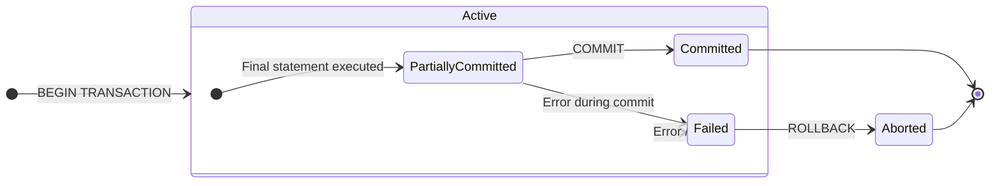
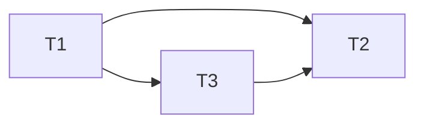
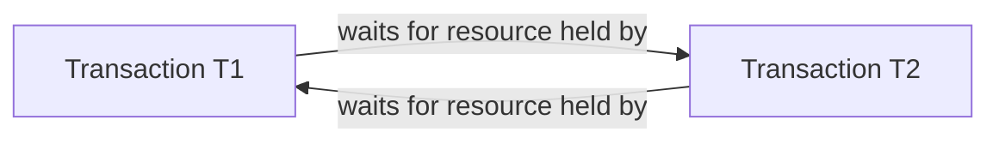

# 7.1 Transactions and ACID
### A. Transaction
- A transaction is a single logical unit of work that accesses and possibly updates various data items in a database.
- It represents a real world event like a bank transfer, a flight booking, or a product purchase.
- A transaction is an all-or-nothing proposition. It must be executed in its entirety or not at all.
- Example: Bank Transfer Transaction:
```sql
BEGIN TRANSACTION;

-- 1. Deduct $100 from Account A
UPDATE accounts SET balance = balance - 100 WHERE account_id = 'A';

-- 2. Add $100 to Account B
UPDATE accounts SET balance = balance + 100 WHERE account_id = 'B';

COMMIT;
```
### B. Properties of Transaction: ACID
- ACID is the cornerstone concept for reliable transaction processing. 
- These four properties guarantee that database transactions are processed reliably, even in the event of errors or system failure.
1. **Atomicity** (All-or-nothing):
	- A transaction must be an atomic unit of work. Either all of its operations are successfully executed, or none of them are.
	- Primarily handled by the 'Transaction Manager' using shadow-copy or log-based schemes.
	- If a transaction fails after updating some data, the `ROLLBACK` command undoes all changes.
	- The `COMMIT` command makes all changes permanent.
	- Prevents partial updates that can leave the database in an inconsistent or corrupted state (e.g., money is deducted from one account but never credited to another).
2. **Consistency** (Rules Keeper):
	- A transaction must transform the database from one consistent state to another consistent state. All defined rules, such as constraints, cascades, and triggers must be preserved.
	- DBMS provides the mechanisms (constraints, triggers), but the transaction itself must be correctly programmed to uphold consistency.
	- Ensures the database's logical integrity is maintained. e.g., it prevents a transaction from creating an order for a non-existent customer.
3. **Integrity** (Separation):
	- Even though multiple transactions may execute concurrently, the system must ensure that the execution of each transaction is isolated from the others.
	- Intermediate results of an uncommitted transaction must not be visible to any other transactions.
	- Handled by the 'Concurrency Control Manager'
	- Prevents concurrency-related problems like:
		- Dirty Reads: Reading uncommitted data from another transaction.
		- Non-repeatable Reads: Getting different values when reading the same row twice.
		- Phantom Reads: Seeing new rows that appeared due to another transaction.
4. Durability:
	- Once a transaction has been committed, its changes must persist in the database permanently, even in the event of a system failure (power loss, crash).
	- Primarily handled by the 'Recovery Manager'.
	- Achieved by writing the transaction's changes to non-volatile storage (like a hard disk) in a transaction log before the `COMMIT` is reported as successful.
	- Guarantees that confirmed work, like a completed purchase, is never lost.
- **Why Necessary for ACID Properties?**
	- They are fundamental for maintaining data integrity, reliability and correctness in multi-user database systems where failures and concurrent access are a reality.
	- Without ACID, databases would be prone to corruption, lost updates and inconsistent states, making them unreliable for critical business operations.
### C. Transaction States (State Diagram)
A transaction moves through a series of states during its lifetime. The following state diagram illustrates this life-cycle:

- **Active**: 
	- The initial state.
	- The transaction is currently executing its read/write operations.
- **Partially Committed**:
	- The final statement of the transaction has been executed.
	- The changes are temporarily held in a buffer, not yet written to disk
	- The transaction is at its most vulnerable point here.
- **Committed**:
	- The transaction has successfully completed all its operations.
	- The `COMMIT` command has been issued, and all changes have been permanently saved to the database.
	- The transaction's effects are now permanent and visible to others (subject to isolation levels).
- **Failed**:
	- The transaction cannot proceed to a successful completion.
	- This can happen due to hardware failure, a deadlock, or a violation of consistency constraints.
- **Aborted**:
	- The transaction has been rolled back after a failure.
	- The database has been restored to its state prior to the transaction's start.
	- The system can now either restart the transaction or terminate it.
### D. Compensating Transaction
- A compensating transaction is a specially designed transaction that semantically undoes the effects of a committed transaction.
- It is used in advanced applications where a traditional rollback is impossible because the original transaction has already been committed.
- **Context**: Used in Long-Running Transactions (LRTs) or certain distributed system architectures where locking resources for the entire duration is not feasible.
- **Working**:
	- Instead of holding locks, transactions are allowed to commit.
	- If the larger business process fails later, a compensating transaction is executed to "logically revert" the changes.
- **Difference from `ROLLBACK`**:
	- `ROLLBACK` is a technical, system-generated action that occurs before commit.
	- A compensating transaction is an application-level, logical action that occurs after the commit. It many not perfectly restore the physical database state (e.g., a log entry for the booking might remain for auditing), but it restores logical consistency.
----
# 7.2 Serialisability Concept
### A. Terminology
1. **Schedule**: A sequence of operations (Read/Write) from a set of concurrent transactions. It defines the order in which the system executes these operations. e.g., ` S1: R1(A), W1(A), R2(A), W2(A)`
2. **Serial Schedule**: A schedule where transactions are executed one after another without any interleaving. The entire first transaction finishes before the second begins. e.g., `T1: R1(A), W1(A)`, `T2: R2(A), W2(A)`
3. **Concurrent (Non-Serial) Schedule**: A schedule where operations from different transactions are interleaved (mixed together). e.g., `R1(A), R2(A), W1(A), W2(A)`
4. **Serialisable Schedule**: A concurrent schedule whose final outcome is equivalent to the outcome of some serial schedule. This is the fundamental goal of concurrency control.
### B. Conflict Equivalent
#### B.1 Concept:
- Two operations conflict if they all meet these three conditions:
	1. They belong to different transactions.
	2. They operate on the same data item.
	3. At least one of them is a Write.
- The pairings that are conflicting or non conflicting are:

| Operations | Type                 |
| ---------- | -------------------- |
| R(A) R(A)  | Non conflicting Pair |
| R(A) W(A)  | Conflicting Pair     |
| W(A) R(A)  | Conflicting Pair     |
| W(A) W(A)  | Conflicting Pair     |
| R(B) R(A)  | Non conflicting Pair |
| W(B) R(A)  | Non conflicting Pair |
| R(B) W(A)  | Non conflicting Pair |
| W(A) W(B)  | Non conflicting Pair |
#### B.2 Conflict Equivalence
- Two schedules are Conflict Equivalent if one can be transformed into the other by swapping adjacent, non-conflicting operations.
- Are S1 and S2 conflict equivalent?
```txt
S1: R₁(A) W₁(A)        R₂(A) W₂(A)
S2: R₁(A) W₁(A) R₂(B)        W₂(A) R₂(B)
```
- Evaluation: In `S1`, `W1(A)` and `R2(B)` are adjacent and non conflicting (different items).
- Swapping them produces `S2`.
- Therefore `S1` and `S2` are conflict equivalent.
#### B.3 Test via Precedence Graph
- A schedule is Conflict Serialisable if it is conflict equivalent to a serial schedule.
- We test this using a Precedence Graph (or Serialisability Graph).
- Algorithm:
	1. Create a node for each transaction in the schedule.
	2. Add a directed edge `T_i -> T_j` if:
		- An operation `O_i` in T$_i$ is executed before an operation O$_j$ in T$_j$.
		- Both operations conflict
	3. Check for cycles: If the graph is acyclic, the schedule is conflict serialisable. If it has a cycle, it is not.
- How to find the equivalent serial schedule:
	- Perform a topological sort on the acyclic graph. The resulting order is the equivalent serial schedule.
### C. Detailed Precedence Graph Example
Problem: Test if the schedule S is conflict serialisable.
```txt
S: r1(y); r3(z); w1(y); w2(z); r3(y); w2(y)
```
Step 1: List conflicts in order
1. `r1(y)` conflicts with `w2(y)` -> Edge: T1 -> T2
2. `w1(y)` conflicts with `r3(y)` -> Edge: T1 -> T3
3. `w1(y)` conflicts with `w2(y)` -> Edge: T1 -> T2
4. `w2(y)` conflicts with `r3(z)`? No. `r3(z)` happened first. no edge
5. `r3(y)` conflicts with `w2(y)` -> Edge: T3 -> T2
Step 2: Build the Precedence Graph.

Step 3: Analyse the Graph.
- The graph is acyclic (no loops)
- Conclusion: Schedule S is conflict serialisable.
Step 4: Find the equivalent serial schedule.
- Perform a topological sort. The only Valid Order is T1, T3, T2.
- The equivalent serial schedule is \[T1, T3, T2].
### D. View Serialisability
#### D.1 Concept:
- A schedule is view serialisable if it is view equivalent to some serial schedule. It's a less restrictive condition that conflict serialisability.
- **View Equivalence**:
	- Two schedules S and S' are view equivalent if these three conditions hold for every data item X:
	1. Initial Read: If T, reads the initial value of X in S, then T must also read the initial value of X in S'.
	2. Update Read: If T$_i$ reads the value of X written by T$_j$ in S, then T$_i$ must also read the value of X written by T$_j$ in S'.
	3. Final Write: The transaction that performs the final write on X in S must be the same transaction that performs the final write on X in S'.
#### D.2 Differences:
| Feature                                 | Conflict Serialisability            | View Serialisability                                               |
| --------------------------------------- | ----------------------------------- | ------------------------------------------------------------------ |
| Basis                                   | Swapping non-conflicting operations | Preservation of read-from relationships                            |
| Restrictiveness                         | More strict.                        | Less strict.                                                       |
| Test                                    | Precedence Graph (efficient).       | More complex, involves checking all possible views.                |
| Blind Writes                            | May not be allowed.                 | Allows blind write (a write without a prior read).                 |
| Every conflict serialisable schedule is | also view serialisable.             | but not every view serialisable schedule is conflict serialisable. |
#### D.3 Example of View Serialisable
Consider the Schedule:
```txt
Schedule S: R1(A) W2(A) W1(A) W3(A)
```
- Conflict Serialisable Test:
	- `R1(A)` conflicts with `W2(A)` -> T1 -> T2
	- `W2(A)` conflicts with `W1(A)` -> T2 -> T1
	- Cycle of T1 -> T2 -> T1
	- Not conflict serialisable.
- View Test:
	- Initial Read: T1 reads the initial value of A.
	- Updated Read: No transaction reads a value written by another transaction (T1 reads initial, T2 and T3 do not read at all - these are blind writes).
	- Final Write: T3 performs the final write on A.
	- The serial schedule T1, T2, T3 has the same view: T1 reads initial A and T3 does the final write. Thus S is view serialisable.
### E. PYQ
`Schedule: r1(X); r3(X); w1(X); r2(X); w3(X)`
Step 1: Identify Conflicts
1. r1(x) conflicts with w3(x) -> T1 -> T3
2. r3(x) conflicts with w1(x) -> T3 -> T1
Step 2: Schedule has a cycle: T1 -> T3 -> T1, so not conflict serialisable.

`Schedule: r1(X); r3(X); w3(X); w1(X); r2(X)`
Step 1: Identify Conflicts
1. r1(x) conflicts with w3(x) -> T1 -> T3
2. r3(x) conflicts with w1(x) -> T3 -> T1
Step 2: Also a cycle: T1 -> T3 -> T1, so not conflict serialisable.

----
# 7.3 Lock based Protocols
### A. Concept
- A lock-based protocol is a mechanism that controls concurrent access to data items by requiring transactions to acquire locks before performing operations.
- This ensures serialisability and prevents conflicts.
- Primary goal is to maintain data consistency and transaction isolation in a multi-user database environment.
### B. Types of Locks:
1. Shared Lock (S-Lock or Read Lock)
	- For **reading** a data item.
	- Multiple transactions can hold a shared lock on the same data item simultaneously.
	- A shared lock is compatible with only other shared locks.
2. Exclusive Lock (X-Lock or Write Lock)
	- For **writing/modifying** a data item.
	- Only one transaction can hold an exclusive lock on a data item at a time.
	- It excludes all other locks.
	- Exclusive lock is incompatible with all other locks.
3. Lock Compatibility Matrix:
- This matrix determines if a requested lock can be granted based on locks already held by other transactions.

| Held\Requested | Shared (S) | Exclusive (X) |
| -------------- | ---------- | ------------- |
| S              | Yes        | No            |
| X              | No         | No            |
### C. Two-Phase Locking (2PL) Protocol
- This is the fundamental protocol that guarantees conflict serialisability.
- Two phases:
	1. Growing Phase:
		- A transaction can acquire locks but cannot release any lock.
		- The transaction accumulates all the locks it needs.
	2. Shrinking Phase:
		- A transaction can release locks but cannot acquire any new locks.
		- Once a single lock is released, the shrinking phase begins.
- Example of 2PL:
	- Consider the transactions:
	  T1: Transfer $100 from A to B: `R(A), W(A), R(B), W(B)`
	- A valid 2PL schedule for T1 could be:
		- Growing Phase: `Lock-X(A)` -> `R(A)` -> `W(A)` -> `Lock-X(B)`
		- Shrinking Phase: `Unlock(A)` -> `R(B)` -> `W(B)` -> `Unlock(B)`
- Limitations of Basic 2PL:
	- Cascading Rollbacks:
		- If T1 unlocks A and then aborts, T2 (which read the unlocked, uncommitted value of A from T1) becomes dependent on an aborted transaction and must also be rolled back.
		- This cascade effect can continue.
	- Deadlocks:
		- 2PL can lead to deadlocks where transactions wait indefinitely for each other's locks
		- example:
			- T1 holds Lock-X(A) and needs Lock-X(B), while 
			- T2 holds Lock-X(B) and needs Lock-X(A).
### D. Strict Two-Phase Locking (Strict 2PL)
- This is the protocol most widely used in practice, because it overcomes the major limitations of basic 2PL.
- Improvement over Basic 2 PL:
	- In strict 2PL, a transaction holds all its exclusive locks until it commits or aborts.
	- Shared locks can be released earlier in some implementations, but the key is that exclusive locks are held until commit.
- How it solves the problem:
	- Prevents Cascading Rollbacks: Since no other transaction can read an uncommitted data item (because of exclusive lock), no transaction becomes dependent on an uncommitted change.
	- If T1 aborts, no other transaction has seen its dirty data.
- Trade off: It results in lower concurrency that basic 2PL because locks are held for a longer duration.
### E. Other Lock-Based Protocols
1. Simplistic Lock Protocol
	- Exclusive Lock Only.
		- Transactions acquire locks (write locks) on data items they intend to modify.
		- Once a transaction holds an exclusive lock on a data item, no other transaction can read or write to that data item until the lock is released.
	- Lock Acquisition
		- A transaction requests an exclusive lock before it performs any write operation (such as an update or delete) on a data item.
		- If another transaction already holds the lock on that data item, the requesting transaction must wait until the lock is released.
	- Lock Release:
		- The exclusive lock is released once the transaction commits or aborts.
		- Upon release, other transactions waiting to acquire the lock can proceed with their operations on the data item.
2. Pre-claiming Lock Protocol
	- Transaction Initiation:
		- Before a transaction begins executing, it pre-claims or pre-acquires locks on all data items it may need during its execution.
		- This is typically done during the transaction's initialisation phase.
	- Lock Acquisition:
		- Instead of acquiring locks on demand, the transaction acquires all necessary locks upfront.
		- Transactions may acquire shared locks (for reading) or exclusive locks (for writing) depending on their operations
	- Execution Phase:
		- Once a transaction has pre-claimed all necessary locks, it proceeds with its operations without needing to acquire additional locks during its execution phase.
		- This reduces the overhead of lock management during the critical path of transaction processing.
	- Lock release:
		- Locks are released in the usual manner after the transaction completes its execution, either by committing or aborting.
		- This ensures that other transactions can subsequently access the data items
### F. Granularity of Locking
Lock granularity refers the the size of the data item chosen as the full unit of protection.
1. **Coarse Granularity**:
	- Locking large objects (e.g., an entire table or database).
	- Adv: Low overhead (fewer locks to manage).
	- Disadv: Low concurrency. Locking an entire table blocks all other transactions accessing any part of that table.
2. **Fine Granularity**
	- Locking small objects (e.g., a single row or attribute within a table).
	- Adv: High concurrency. Multiple transactions can work on different rows of the same table simultaneously.
	- Disadv: High overhead (many more locks to manage)
3. **Multiple Granularity Locking**
	- A hierarchical protocol that allows transactions to lock data items at different levels of the hierarchy (e.g., Database -> Table -> Page -> Row).
	- Working: It uses intention locks.
		- Intention-Shared (IS): indicates intent to read at a finer granularity (e.g., setting IS on a table before locking a row in S-mode)
		- Shared (S): indicates that the table is locked in shared mode.
		- Intention-Exclusive (IX): indicates intent to write at a finer granularity.
		- Shared+Intention-Exclusive (SIX): The table is locked in shared mode, but the exclusive locks are being taken on some of its rows (common in queries that read the whole table but update a few rows).
###### Compatibility Matrix for Multiple Granularity
| Held↓\ Requested -> | IS  | IX  | S   | SIX | X   |
| ------------------- | --- | --- | --- | --- | --- |
| IS                  | ✅   | ✅   | ✅   | ✅   | ❌   |
| IX                  | ✅   | ✅   | ❌   | ❌   | ❌   |
| S                   | ✅   | ❌   | ✅   | ❌   | ❌   |
| SIX                 | ✅   | ❌   | ❌   | ❌   | ❌   |
| X                   | ❌   | ❌   | ❌   | ❌   | ❌   |
### G. Graph-Based Protocol
- A concurrency control protocol that imposes a partial order on the set of all data items using a directed acyclic graph (DAG).
- Working:
	- Data Item Ordering: All data items are organised in a DAG structure (e.g., A->B->C).
	- Locking Rule: A transaction can lock a data item, only after it has locked all its predecessors in the graph. For example, to lock C, a transaction must first lock A and then B.
	- Unlocking Rule: A transaction can unlock any data item at any time. However, after unlocking a data item, it cannot lock any new data item, similar to 2PL's shrinking phase.
- Adv: Deadlock-free. The ordering prevents the circular wait condition necessary for a deadlock.
- Disadv: Requires pre-knowledge of the data access pattern, which is not always available.
- Example: If the graph is A -> B -> C, a transaction must lock in the order A, B, C. This prevents a scenario where T1 holds B and waits for C, while T2 holds C and waits for B.
----
# 7.4 Deadlock Handling and Prevention
### A. Concept
- A deadlock is a situation where two or more transactions are unable to proceed because each is waiting for a resource that another transaction in the set holds.
- Visual Representation (cycle indicates a deadlock):

### B. Characteristics (Necessary Conditions)
- **Mutual exclusion**: 
	- At least one resource must be held in a non-shareable (exclusive) mode.
	- Example: An Exclusive lock on a data item.
- **Hold and Wait**: 
	- A transaction must be holding at least one resource and waiting to acquire additional resources that are currently held by other transactions.
- **No preemption**: 
	- Resources cannot be forcibly taken away from a transaction.
	- A resource can only be released voluntarily by the transaction holding it.
- **Circular Wait**: 
	- A set of waiting transactions must exist such that each transaction is waiting for a resource held by the next transaction in the circle: `T1 -> T2 -> ... Tn -> T1`.
### C. Deadlock Prevention
These protocols ensure that at least one of the four necessary conditions cannot hold, making deadlocks impossible.
1. Eliminate "Hold-and-wait" (Pre-claiming)
	- A transaction must lock all data items it will need at the beginning, before it starts execution.
	- This however, reduces concurrency and is often impractical as it maybe hard to know all required data items in advance.
2. Allow Preemption
	- This strategy uses transaction timestamps (TS) to decide which transaction should be aborted when a conflict occurs.
	- **Wait-Die Scheme** (Older waits, Younger dies)
		- Rule: if `T1` requests a lock held by `T2`:
			- If TS(`T1`) < TS(`T2`) i.e. `T1` is older than `T2`, then `T1` waits.
			- If TS(`T1`) > TS(`T2`) i.e. `T1` is younger than `T2`, then `T1` is aborted ("dies").
		- Logic: 
			- An older transaction is allowed to wait for a younger one.
			- A younger transaction is never allowed to wait for an older one (it is killed instead), preventing a cycle where a young transaction holds a resource needed by an old one
		- Example:
			- `T1` (TS=10) holds Lock-X(A).
			- `T2` (TS=20) holds Lock-X(A).
			- Since `T2` is younger, it is aborted (it "dies").
	- **Wound-Wait scheme** (Older wounds, younger waits)
		- Rule: if `T1` requests a lock held by `T2`:
			- If TS(`T1`) < TS(`T2`) i.e. `T1` is older than `T2`, then `T2` is aborted (`T1` wounds `T2`).
			- If TS(`T1`) ? TS(`T2`) i.e. `T1` is younger than `T2`, then `T1` waits.
		- Logic:
			- An older transaction can preempt (forcefully abort) a younger one.
			- A younger transaction must wait for an older one.
			- This prevents circular wait.
		- Example:
			- `T1` (TS=10) holds Lock-X(A).
			- `T2` (TS=20) requests Lock-X(A).
			- Since `T2` is younger, it waits.
			- Now, if `T1` requests a lock held by `T2`, `T1` is older, so it would "wound" `T2`, causing `T2` to be aborted and releasing its locks for `T1`.
	- Comparison:

| Feature                       | Wait-Die                                                                | Wound-Wait                                                             |
| ----------------------------- | ----------------------------------------------------------------------- | ---------------------------------------------------------------------- |
| Action on Older Transaction   | Waits for younger                                                       | Wounds (aborts) younger                                                |
| Action on Younger Transaction | Aborted                                                                 | Waits for older                                                        |
| Number of Rollbacks           | Potentially more (young transactions keep dying)                        | Potentially fewer (young transactions simply wait)                     |
| Starvation                    | A young transaction may repeatedly die if it conflicts with older ones. | An old transaction can't starve, as it will always wound younger ones. |
### D. Deadlock Detection
Method: **Wait-For Graph Analysis**:
- The system maintains a directed graph where each nodes are transactions.
- An edge T1 -> T2 exists if T1 is waiting for a resource held by T2.
- A deadlock exists if and only if the wait-for graph contains a cycle.
- The system runs a cycle-detecting algorithm periodically to check for deadlocks.
### E. Deadlock Recovery
1. Transaction Rollback:
	- Abort one or more transaction to break the deadlock cycle.
	- The choice of transaction to abort can be based on criteria such as transaction age, the number of resources held, or transaction's priority.
2. Cascading Rollback:
	- Abort a set of transactions and undo all their operations until the system reaches a consistent state.
	- This can cause other transactions to abort, leading to a cascading effect.
	- How to select victims of abortion of transaction:
		- Youngest Transaction: The one that started most recently.
		- Transaction with Least work: the one that has performed the fewest updates (minimises rollback cost).
		- Transaction Holding fewest resources.
3. Resource Preemption:
	- Temporarily revoke some resources from transactions and assign them to other transactions to resolve the deadlock.
### F. Deadlock Avoidance
These methods require additional information about transactions to dynamically decide whether to allow transactions to proceed or not.
- Wait-For Graph: Construct a wait-for graph where nodes represent transactions and directed edges represent waiting dependencies. Regularly check for cycles in this graph; a cycle indicates a deadlock.
- Banker's Algorithm: Similar to DIjkstra's Algorithm, Banker's Algorithm is used in operating systems. It ensures that a system remains in a safe state by checking the resource allocation graph to determine if resource allocation will lead to a safe state.

[[Chapter 8 Crash Recovery]]