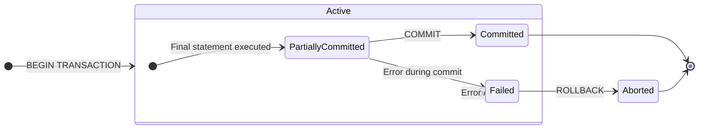
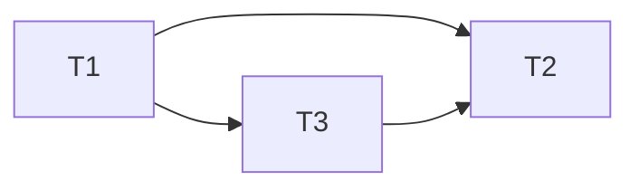

# 7.1 Transactions and ACID
### A. Transaction
- A transaction is a single logical unit of work that accesses and possibly updates various data items in a database.
- It represents a real world event like a bank transfer, a flight booking, or a product purchase.
- A transaction is an all-or-nothing proposition. It must be executed in its entirety or not at all.
- Example: Bank Transfer Transaction:
```sql
BEGIN TRANSACTION;

-- 1. Deduct $100 from Account A
UPDATE accounts SET balance = balance - 100 WHERE account_id = 'A';

-- 2. Add $100 to Account B
UPDATE accounts SET balance = balance + 100 WHERE account_id = 'B';

COMMIT;
```
### B. Properties of Transaction: ACID
- ACID is the cornerstone concept for reliable transaction processing. 
- These four properties guarantee that database transactions are processed reliably, even in the event of errors or system failure.
1. **Atomicity** (All-or-nothing):
	- A transaction must be an atomic unit of work. Either all of its operations are successfully executed, or none of them are.
	- Primarily handled by the 'Transaction Manager' using shadow-copy or log-based schemes.
	- If a transaction fails after updating some data, the `ROLLBACK` command undoes all changes.
	- The `COMMIT` command makes all changes permanent.
	- Prevents partial updates that can leave the database in an inconsistent or corrupted state (e.g., money is deducted from one account but never credited to another).
2. **Consistency** (Rules Keeper):
	- A transaction must transform the database from one consistent state to another consistent state. All defined rules, such as constraints, cascades, and triggers must be preserved.
	- DBMS provides the mechanisms (constraints, triggers), but the transaction itself must be correctly programmed to uphold consistency.
	- Ensures the database's logical integrity is maintained. e.g., it prevents a transaction from creating an order for a non-existent customer.
3. **Integrity** (Separation):
	- Even though multiple transactions may execute concurrently, the system must ensure that the execution of each transaction is isolated from the others.
	- Intermediate results of an uncommitted transaction must not be visible to any other transactions.
	- Handled by the 'Concurrency Control Manager'
	- Prevents concurrency-related problems like:
		- Dirty Reads: Reading uncommitted data from another transaction.
		- Non-repeatable Reads: Getting different values when reading the same row twice.
		- Phantom Reads: Seeing new rows that appeared due to another transaction.
4. Durability:
	- Once a transaction has been committed, its changes must persist in the database permanently, even in the event of a system failure (power loss, crash).
	- Primarily handled by the 'Recovery Manager'.
	- Achieved by writing the transaction's changes to non-volatile storage (like a hard disk) in a transaction log before the `COMMIT` is reported as successful.
	- Guarantees that confirmed work, like a completed purchase, is never lost.
- **Why Necessary for ACID Properties?**
	- They are fundamental for maintaining data integrity, reliability and correctness in multi-user database systems where failures and concurrent access are a reality.
	- Without ACID, databases would be prone to corruption, lost updates and inconsistent states, making them unreliable for critical business operations.
### C. Transaction States (State Diagram)
A transaction moves through a series of states during its lifetime. The following state diagram illustrates this life-cycle:

- **Active**: 
	- The initial state.
	- The transaction is currently executing its read/write operations.
- **Partially Committed**:
	- The final statement of the transaction has been executed.
	- The changes are temporarily held in a buffer, not yet written to disk
	- The transaction is at its most vulnerable point here.
- **Committed**:
	- The transaction has successfully completed all its operations.
	- The `COMMIT` command has been issued, and all changes have been permanently saved to the database.
	- The transaction's effects are now permanent and visible to others (subject to isolation levels).
- **Failed**:
	- The transaction cannot proceed to a successful completion.
	- This can happen due to hardware failure, a deadlock, or a violation of consistency constraints.
- **Aborted**:
	- The transaction has been rolled back after a failure.
	- The database has been restored to its state prior to the transaction's start.
	- The system can now either restart the transaction or terminate it.
### D. Compensating Transaction
- A compensating transaction is a specially designed transaction that semantically undoes the effects of a committed transaction.
- It is used in advanced applications where a traditional rollback is impossible because the original transaction has already been committed.
- **Context**: Used in Long-Running Transactions (LRTs) or certain distributed system architectures where locking resources for the entire duration is not feasible.
- **Working**:
	- Instead of holding locks, transactions are allowed to commit.
	- If the larger business process fails later, a compensating transaction is executed to "logically revert" the changes.
- **Difference from `ROLLBACK`**:
	- `ROLLBACK` is a technical, system-generated action that occurs before commit.
	- A compensating transaction is an application-level, logical action that occurs after the commit. It many not perfectly restore the physical database state (e.g., a log entry for the booking might remain for auditing), but it restores logical consistency.
----
# 7.2 Serialisability Concept
### A. Terminology
1. **Schedule**: A sequence of operations (Read/Write) from a set of concurrent transactions. It defines the order in which the system executes these operations. e.g., ` S1: R1(A), W1(A), R2(A), W2(A)`
2. **Serial Schedule**: A schedule where transactions are executed one after another without any interleaving. The entire first transaction finishes before the second begins. e.g., `T1: R1(A), W1(A)`, `T2: R2(A), W2(A)`
3. **Concurrent (Non-Serial) Schedule**: A schedule where operations from different transactions are interleaved (mixed together). e.g., `R1(A), R2(A), W1(A), W2(A)`
4. **Serialisable Schedule**: A concurrent schedule whose final outcome is equivalent to the outcome of some serial schedule. This is the fundamental goal of concurrency control.
### B. Conflict Equivalent
#### B.1 Concept:
- Two operations conflict if they all meet these three conditions:
	1. They belong to different transactions.
	2. They operate on the same data item.
	3. At least one of them is a Write.
- The pairings that are conflicting or non conflicting are:

| Operations | Type                 |
| ---------- | -------------------- |
| R(A) R(A)  | Non conflicting Pair |
| R(A) W(A)  | Conflicting Pair     |
| W(A) R(A)  | Conflicting Pair     |
| W(A) W(A)  | Conflicting Pair     |
| R(B) R(A)  | Non conflicting Pair |
| W(B) R(A)  | Non conflicting Pair |
| R(B) W(A)  | Non conflicting Pair |
| W(A) W(B)  | Non conflicting Pair |
#### B.2 Conflict Equivalence
- Two schedules are Conflict Equivalent if one can be transformed into the other by swapping adjacent, non-conflicting operations.
- Are S1 and S2 conflict equivalent?
```txt
S1: R₁(A) W₁(A)        R₂(A) W₂(A)
S2: R₁(A) W₁(A) R₂(B)        W₂(A) R₂(B)
```
- Evaluation: In `S1`, `W1(A)` and `R2(B)` are adjacent and non conflicting (different items).
- Swapping them produces `S2`.
- Therefore `S1` and `S2` are conflict equivalent.
#### B.3 Test via Precedence Graph
- A schedule is Conflict Serialisable if it is conflict equivalent to a serial schedule.
- We test this using a Precedence Graph (or Serialisability Graph).
- Algorithm:
	1. Create a node for each transaction in the schedule.
	2. Add a directed edge `T_i -> T_j` if:
		- An operation `O_i` in T$_i$ is executed before an operation O$_j$ in T$_j$.
		- Both operations conflict
	3. Check for cycles: If the graph is acyclic, the schedule is conflict serialisable. If it has a cycle, it is not.
- How to find the equivalent serial schedule:
	- Perform a topological sort on the acyclic graph. The resulting order is the equivalent serial schedule.
### C. Detailed Precedence Graph Example
Problem: Test if the schedule S is conflict serialisable.
```txt
S: r1(y); r3(z); w1(y); w2(z); r3(y); w2(y)
```
Step 1: List conflicts in order
1. `r1(y)` conflicts with `w2(y)` -> Edge: T1 -> T2
2. `w1(y)` conflicts with `r3(y)` -> Edge: T1 -> T3
3. `w1(y)` conflicts with `w2(y)` -> Edge: T1 -> T2
4. `w2(y)` conflicts with `r3(z)`? No. `r3(z)` happened first. no edge
5. `r3(y)` conflicts with `w2(y)` -> Edge: T3 -> T2
Step 2: Build the Precedence Graph.

Step 3: Analyse the Graph.
- The graph is acyclic (no loops)
- Conclusion: Schedule S is conflict serialisable.
Step 4: Find the equivalent serial schedule.
- Perform a topological sort. The only Valid Order is T1, T3, T2.
- The equivalent serial schedule is \[T1, T3, T2].
### D. View Serialisability
#### D.1 Concept:
- A schedule is view serialisable if it is view equivalent to some serial schedule. It's a less restrictive condition that conflict serialisability.
- **View Equivalence**:
	- Two schedules S and S' are view equivalent if these three conditions hold for every data item X:
	1. Initial Read: If T, reads the initial value of X in S, then T must also read the initial value of X in S'.
	2. Update Read: If T$_i$ reads the value of X written by T$_j$ in S, then T$_i$ must also read the value of X written by T$_j$ in S'.
	3. Final Write: The transaction that performs the final write on X in S must be the same transaction that performs the final write on X in S'.
#### D.2 Differences:
| Feature                                 | Conflict Serialisability            | View Serialisability                                               |
| --------------------------------------- | ----------------------------------- | ------------------------------------------------------------------ |
| Basis                                   | Swapping non-conflicting operations | Preservation of read-from relationships                            |
| Restrictiveness                         | More strict.                        | Less strict.                                                       |
| Test                                    | Precedence Graph (efficient).       | More complex, involves checking all possible views.                |
| Blind Writes                            | May not be allowed.                 | Allows blind write (a write without a prior read).                 |
| Every conflict serialisable schedule is | also view serialisable.             | but not every view serialisable schedule is conflict serialisable. |
#### D.3 Example of View Serialisable
Consider the Schedule:
```txt
Schedule S: R1(A) W2(A) W1(A) W3(A)
```
- Conflict Serialisable Test:
	- `R1(A)` conflicts with `W2(A)` -> T1 -> T2
	- `W2(A)` conflicts with `W1(A)` -> T2 -> T1
	- Cycle of T1 -> T2 -> T1
	- Not conflict serialisable.
- View Test:
	- Initial Read: T1 reads the initial value of A.
	- Updated Read: No transaction reads a value written by another transaction (T1 reads initial, T2 and T3 do not read at all - these are blind writes).
	- Final Write: T3 performs the final write on A.
	- The serial schedule T1, T2, T3 has the same view: T1 reads initial A and T3 does the final write. Thus S is view serialisable.
### E. PYQ
`Schedule: r1(X); r3(X); w1(X); r2(X); w3(X)`
Step 1: Identify Conflicts
1. r1(x) conflicts with w3(x) -> T1 -> T3
2. r3(x) conflicts with w1(x) -> T3 -> T1
Step 2: Schedule has a cycle: T1 -> T3 -> T1, so not conflict serialisable.

`Schedule: r1(X); r3(X); w3(X); w1(X); r2(X)`
Step 1: Identify Conflicts
1. r1(x) conflicts with w3(x) -> T1 -> T3
2. r3(x) conflicts with w1(x) -> T3 -> T1
Step 2: Also a cycle: T1 -> T3 -> T1, so not conflict serialisable.

----
# 7.3 Lock based Protocols
1. Describe granularity of locking for concurrency control.
2. Difference between fine granularity and coarse granularity in multiple granularity locking protocol.
3. Explain two phase locking protocol for concurrency control with example and its limitations.
4. How does strict two phase locking protocol improve the two phase locking protocol?
5. Explain the different types of locks used for concurrency control. Draw the lock compatibility matrix.
6. Explain how graph based protocol maintains concurrent execution of transactions.
----
# 7.4 Deadlock Handling and Prevention
1. How deadlocks arise in transaction processing?
2. Explain wait & die scheme and wound-wait for deadlock prevention
3. Explain deadlock prevention strategies.