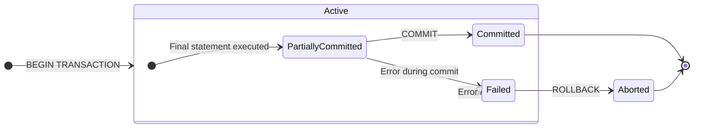

# 7.1 Transactions and ACID
### A. Transaction
- A transaction is a single logical unit of work that accesses and possibly updates various data items in a database.
- It represents a real world event like a bank transfer, a flight booking, or a product purchase.
- A transaction is an all-or-nothing proposition. It must be executed in its entirety or not at all.
- Example: Bank Transfer Transaction:
```sql
BEGIN TRANSACTION;

-- 1. Deduct $100 from Account A
UPDATE accounts SET balance = balance - 100 WHERE account_id = 'A';

-- 2. Add $100 to Account B
UPDATE accounts SET balance = balance + 100 WHERE account_id = 'B';

COMMIT;
```
### B. Properties of Transaction: ACID
- ACID is the cornerstone concept for reliable transaction processing. 
- These four properties guarantee that database transactions are processed reliably, even in the event of errors or system failure.
1. **Atomicity** (All-or-nothing):
	- A transaction must be an atomic unit of work. Either all of its operations are successfully executed, or none of them are.
	- Primarily handled by the 'Transaction Manager' using shadow-copy or log-based schemes.
	- If a transaction fails after updating some data, the `ROLLBACK` command undoes all changes.
	- The `COMMIT` command makes all changes permanent.
	- Prevents partial updates that can leave the database in an inconsistent or corrupted state (e.g., money is deducted from one account but never credited to another).
2. **Consistency** (Rules Keeper):
	- A transaction must transform the database from one consistent state to another consistent state. All defined rules, such as constraints, cascades, and triggers must be preserved.
	- DBMS provides the mechanisms (constraints, triggers), but the transaction itself must be correctly programmed to uphold consistency.
	- Ensures the database's logical integrity is maintained. e.g., it prevents a transaction from creating an order for a non-existent customer.
3. **Integrity** (Separation):
	- Even though multiple transactions may execute concurrently, the system must ensure that the execution of each transaction is isolated from the others.
	- Intermediate results of an uncommitted transaction must not be visible to any other transactions.
	- Handled by the 'Concurrency Control Manager'
	- Prevents concurrency-related problems like:
		- Dirty Reads: Reading uncommitted data from another transaction.
		- Non-repeatable Reads: Getting different values when reading the same row twice.
		- Phantom Reads: Seeing new rows that appeared due to another transaction.
4. Durability:
	- Once a transaction has been committed, its changes must persist in the database permanently, even in the event of a system failure (power loss, crash).
	- Primarily handled by the 'Recovery Manager'.
	- Achieved by writing the transaction's changes to non-volatile storage (like a hard disk) in a transaction log before the `COMMIT` is reported as successful.
	- Guarantees that confirmed work, like a completed purchase, is never lost.
- **Why Necessary for ACID Properties?**
	- They are fundamental for maintaining data integrity, reliability and correctness in multi-user database systems where failures and concurrent access are a reality.
	- Without ACID, databases would be prone to corruption, lost updates and inconsistent states, making them unreliable for critical business operations.
### C. Transaction States (State Diagram)
A transaction moves through a series of states during its lifetime. The following state diagram illustrates this life-cycle:

- **Active**: 
	- The initial state.
	- The transaction is currently executing its read/write operations.
- **Partially Committed**:
	- The final statement of the transaction has been executed.
	- The changes are temporarily held in a buffer, not yet written to disk
	- The transaction is at its most vulnerable point here.
- **Committed**:
	- The transaction has successfully completed all its operations.
	- The `COMMIT` command has been issued, and all changes have been permanently saved to the database.
	- The transaction's effects are now permanent and visible to others (subject to isolation levels).
- **Failed**:
	- The transaction cannot proceed to a successful completion.
	- This can happen due to hardware failure, a deadlock, or a violation of consistency constraints.
- **Aborted**:
	- The transaction has been rolled back after a failure.
	- The database has been restored to its state prior to the transaction's start.
	- The system can now either restart the transaction or terminate it.
### D. Compensating Transaction
- A compensating transaction is a specially designed transaction that semantically undoes the effects of a committed transaction.
- It is used in advanced applications where a traditional rollback is impossible because the original transaction has already been committed.
- **Context**: Used in Long-Running Transactions (LRTs) or certain distributed system architectures where locking resources for the entire duration is not feasible.
- **Working**:
	- Instead of holding locks, transactions are allowed to commit.
	- If the larger business process fails later, a compensating transaction is executed to "logically revert" the changes.
- **Difference from `ROLLBACK`**:
	- `ROLLBACK` is a technical, system-generated action that occurs before commit.
	- A compensating transaction is an application-level, logical action that occurs after the commit. It many not perfectly restore the physical database state (e.g., a log entry for the booking might remain for auditing), but it restores logical consistency.
----
# 7.2 Concurrent Executions
1. Explain how graph based protocol maintains concurrent execution of transactions.
----
# 7.3 Serialisability Concept
1. Define schedule and give proper examples.
2. What is a serialisable schedule schedule and what does serialisability of a schedule mean?
3. explain the concept of conflict serialisability, with example.
4. How to test Conflict Serialisability of a Schedule S, explain in details with example.
5. Describe how conflict serialisability differs from view serialisablity for concurrent execution of transactions
6. Describe the concept of view serialisability.
7. Consider a schedule S: r1(y); r3(z); w1(y); w2(z); r3(y); w2(y). State whether it is conflict
serialisable schedule or not. Determine the equivalent serial schedule if it is serialisable.
8. Which of the following schedule is conflict serializable? For each serializable schedule, determine the equivalent serial schedule.
   r1(X); r3(X); w1(X); r2(X); w3(X)
   r1(X); r3(X); w3(X); w1(X); r2(X)
----
# 7.4 Lock based Protocols
1. Describe granularity of locking for concurrency control.
2. Difference between fine granularity and coarse granularity in multiple granularity locking protocol.
3. Explain two phase locking protocol for concurrency control with example and its limitations.
4. How does strict two phase locking protocol improve the two phase locking protocol?
5. Explain the different types of locks used for concurrency control. Draw the lock compatibility matrix.
----
# 7.5 Deadlock Handling and Prevention
1. How deadlocks arise in transaction processing?
2. Explain wait & die scheme and wound-wait for deadlock prevention
3. Explain deadlock prevention strategies.