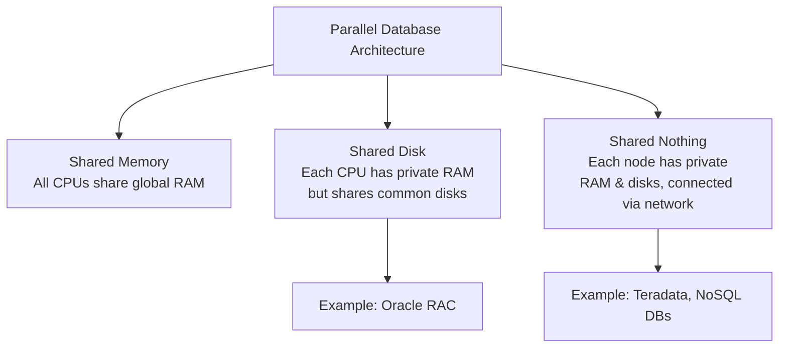

# 9.1 Concept of Object-Oriented
### A. Concept
- An Object-Oriented Database (OODB) represents data as objects, like in object-oriented programming.
- Each object is an instance of a class, which encapsulates both its state (attributes) and its behaviour (methods), allowing for a more direct representation of real-world entities.
### B. Differences between OODBMS and RDBMS:
| Feature                   | OODBMS                                           | RDBMS                                    |
| ------------------------- | ------------------------------------------------ | ---------------------------------------- |
| Basic Unit                | Objects                                          | Tables, Rows, Columns                    |
| Data Type                 | Complex, user-defined                            | Simple, native (e.g., integer, text)     |
| Behaviour                 | Encapsulates data with methods                   | Data is separate from application logic. |
| Relationships             | Via Object references (pointers)                 | Via foreign keys and joins.              |
| Language  Integrations | Seamless with OOP languages (e.g., Java, C++) | Uses separate SQL                        |
### C. Features of OODBS:
- Encapsulation: Combines attributes and methods into a single object.
- Inheritance: Allows new classes to be derived from existing ones.
- Complex Objects: Supports objects within objects (nested structures).
- Object Identity: Objects have a unique independent of their value.
- Polymorphism: Methods can operate on objects of different classes.
### D. Advantages and Significance of OODBS:
- Easier design: models complex real-world applications more naturally.
- Modularity & Re-usability: Classes and objects can be reused across systems.
- Reduced Impedance Mismatch: Integrates seamlessly with OOP languages, avoiding the need for translation objects and database tables.
- Handles Complex Data: Ideal for domains like CAD, multimedia and scientific data.
### E. Object Relational Mapping (ORM)
- is a programming technique that automatically converts data betwen an object-oriented language (like Java) and a relational database (like SQL).
- creates a "virtual object database" within the application, allowing developers to interact with obejcts while the ORM tool handles the underlying SQL and database transactions.

---
# 9.2 Distributed Database Model
### A. Concept
- A distributed database system stores data across multiple physical locations (nodes) connected via a network.
- They are loosely coupled sites that share no physical component.
### B. Types
- **Homogeneous**:
	- All sites have identical software.
	- Are aware of each other and agree to cooperate in processing user requests.
	- Each site surrenders part of its autonomy in terms of right to change schema or software
	- Appears to user as a single system.
	- uniform system
	- easier to manage and design
	- all nodes cooperate seamlessly
- **Heterogeneous**:
	- Different sites may use different schema and software.
	- Difference in schema is a major problem for query processing.
	- Difference in software is a major problem for transaction processing.
	- Sites may not be aware of each other and may provide only limited facilities for cooperation in transaction processing.
	- mixed systems
	- more flexible but complex due to different software/schema
	- require gateways for communication
### B. Properties and Fragmentation:
- **Data distribution**: Achieved via partitioning (horizontal/vertical) and schema. Here, fragmentation is the division of relation r into fragments `r1`, `r2`, ..., `rn` which contain sufficient information to reconstruct relation r.
	- **Horizontal Fragmentation** (Sharding): Divides a table into row subsets. e.g, storing customer records for different regions on different servers.
	- **Vertical Fragmentation**: Divides a table into column subsets. e.g., Storing sensitive columns on a separate, more secure server from other details.
- **Transparency**:
	- Location: User doesn't need to know where data is stored.
	- Replication: User is unaware of data copies
	- Fragmentation: User sees a logical unified view, not physical fragments.
### F. Advantages of Distributed Databases:
- **Improved Availability and Reliability**: Data replication ensures that the system remains operational even if some nodes fail. 
- **Scalability**: The system can handle growth by adding more nodes. 
- **Geographical Distribution**: Data can be stored closer to where it is needed, reducing access latency. 
- **Flexibility**: Allows integration of different types of databases and data models. 
### G. Disadvantages of Distributed Databases: 
- **Complexity**: More complex to design, implement, and manage compared to centralised databases. 
- **Consistency Challenges**: Ensuring data consistency across multiple nodes can be difficult. 
- **Performance Overhead**: Coordination and communication between nodes can introduce performance overhead. 
- **Security Risks**: Data distributed across multiple locations can be more vulnerable to security breaches.

---
# 9.3 Parallel Databases
### A. Concept:
- Parallel databases use multiple processors and storage devices within a single, tightly-coupled system to perform data processing tasks concurrently.
- The primary goal is to significantly improve performance (throughput and reduced response time) for large-scale database operations by dividing work among multiple resources.
### B. Architecture:

Parallel Database Architecture follow one of three main architectural models:
- **Shared Memory**: All processors access a common, central memory. Simple but limited scalability due to memory contention.
- **Shared Disk**: Each processor has its own private memory, but all access a common set of disks. Avoids memory contention but can have disk I/O bottlenecks.
- **Shared Nothing**: Each processor has its own private memory and disks. Nodes communicate via a network. Highly scalable and most common for large systems.
### C. Benefits:
- **High performance**: Dramatically faster query processing through intra-query parallelism
- **Improved Throughput**: Ability to execute multiple queries simultaneously (inter-query parallelism).
- **Scalability**: Can handle increasing workloads by adding more processors, storage and memory.
- **High Availability** & **Fault Tolerance**: Built-in redundancy allows the system to continue operation even if one processor or disk fails.
- **Cost-effectiveness**: Using many small, cheap components, can be more economical than a single, powerful supercomputer.
### D. Difference Between Parallel & Distributed
| Feature      | Parallel Database              | Distributed Database                                   |
| ------------ | ------------------------------ | ------------------------------------------------------ |
| Primary Goal | Performance & throughput       | Data sharing, availability & geographical distribution |
| Hardware     | Tightly-coupled, homogenous    | Loosely-coupled, can be heterogeneous                  |
| Location     | Nodes are physically close     | Nodes can be geographically dispersed                  |
| Control      | Centralised management         | Decentralised management                               |
| Design Focus | Speed via internal parallelism | Transparency & autonomy                                |
| Complex      | High in system design          | High in network & coordination management.             |

---
# 9.4 Concept of Data warehouse Database
### A. Concept:
- Data warehouse is a specialised database designed for querying and analysis, not transaction processing.
- It integrates data from various sources into a single, consistent store to support business intelligence (BI) and decision-making.
- Key features include being
	- subject-oriented (e.g., sales, customers),
	- integrated (data is cleaned and standardised),
	- time-variant (stores historical data) and
	- non-volatile (data is not changed after loading).
### B. Importance
They are crucial because they provide a consolidated, historical view of an organisation's data. This enables:
- Informed Decision-Making: By offering a single source of truth for trend analysis and reporting.
- Improved Data Quality: Through the ETL processes which cleanses and standardises data from disparate (different kinds of) sources.
- Enhanced Performance: They are optimised for complex read queries, separating analytical workload from operational systems (OTLP).
### C. Applications
- A Data Warehouse serves as the central data repository for a suite of analytical applications.
- Its core components are the ETL process (Extract, Transform, Load) and storage in a dimensional model (Fact and Dimension tables).
- Associated applications that access the warehouse include:
	- OLAP (Online analytical Processing) Tools: For multidimensional analysing (e.g., slicing and dicing data).
	- Data Mining Tools: To discover hidden patterns and relationships.
	- Reporting and Dashboard Tools: For creating standardised reports and visualisations.
### D. Differences in Data Warehousing and Data Mining
| Aspect  | Data Warehousing                                                                  | Data Mining                                                                                       |
| ------- | --------------------------------------------------------------------------------- | ------------------------------------------------------------------------------------------------- |
| Purpose | To store and manage integrated, historical                                        | To discover hidden patterns and knowledge within large datasets.                                  |
| Process | ETL (Extract, Transform, Load) and data consolidation                             | Using algorithm (clustering, classification) for pattern discovery                                |
| Output  | A structured, query-optimised database                                            | Insights, predictions and patterns (e.g., customer segments)                                      |
| Analogy | Building an organised library of books                                            | Analysing the books to discover new theories and trends.                                          |
| Example | Building a central database that combines sales, marketing and supply chain data. | Using that database to find that "customers who buy product A often buy product B within 2 weeks" |

---
# 9.5 Concept of Spatial Database
### A. Concept
- Spatial data represents information about the location, shape and geometric property of objects in a geometric space.
- It defines objects using coordinates and can represent simple features like points, lines, and polygons.
- A spatial database is optimised to store, manage and query spatial data.
- It extends standard databases with:
	- Specialised data types: For points, lines and polygons.
	- Spatial Indexing: Uses structures like R-trees and Quad-trees to speed up spatial queries.
	- Spatial functions: supports operations like Intersects, Within and Distance to determine spatial relationship between objects.
- It is essential for GIS, mapping and location-based services.
### B. Applications:
- Geographic Information Systems (GIS): urban planning, environmental monitoring, mapping and transportation systems.
- Location-Based Services (LBS): Navigation apps, ride-sharing and location-aware advertising.
- Computer-Aided Design (CAD): Architectural blueprints and engineering designs..
- Environmental Management: Tracking deforestation, managing natural resources, and disaster response planning.
### C. Spatial Indexing
- Spatial Databases uses specialised indexing methods to improve the performance of spatial queries.
- Common types of spatial indexes include:
	- R-tree: A tree data structure used for indexing multi-dimensional information. It's efficient for range queries and nearest neighbour searches.
	- Quad-tree: Divides the space into four quadrants recursively, useful for region queries.
	- Grid Index: Divides the space into a grid of cells, and objects are indexed based on the cells they occupy.
### D. How to store spatial data in a database?
- Spatial data is stored using specialised column data types (e.g., `POINT`, `LINESTRING`, `POLYGON`).
- Databases like PostGIS (PostgreSQL) or SQL server with spatial extensions provide these types.
- Data is inserted using well-known text (WKT) or well-known binary (WKB) formats.
- Spatial indexes are created to enable efficient querying of geometric relationships.
